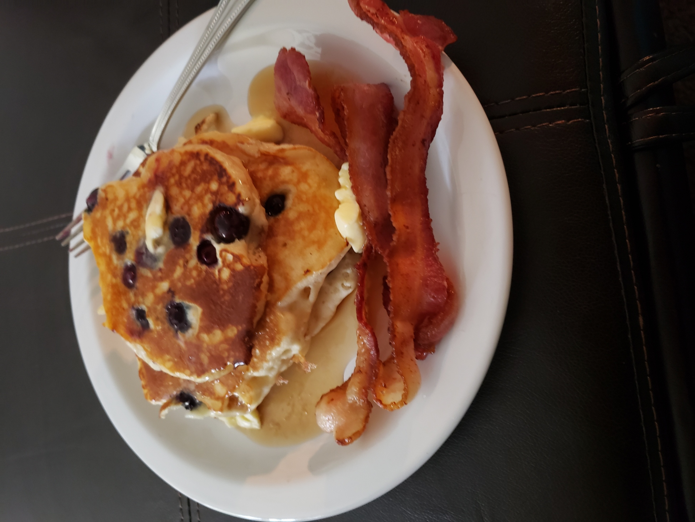

# Hello World - 
# It's Michael Mandell
## Cis-gender Gay Male / Him / He  Github is [Michael Mandell](https://github.com/DaddyBearSEA)

## What is growth mindset
Right Side brain / Left Side Brain - Massage therapist have to use both sides. Creative, but science based. Growth mindset uses growth (left brain) and fixed (right). Growth mindset is looking at situations with open arms, embrace the challenges, learn from mistakes and stop the insanity 
>doing the same thing over and over with the same results *101

I had a Hotel Manager that taught me that a client issue is an opportunity to shine. Under promise - over deliver. In the massage world, you leave your bias at the door. You can't know what's going on until you get your hands on the person, testing range of motion, feeling the motion, listening to the patient's complaints.  Looking at the issue from above and below! Knee pain can be anything from wrong shoes to low back imbalance.  
1. Keep and open mind and look at issues from all angles - you are hear to learn and grow
1. Obstacles are just barriers to break down and *Seize the Opportunity*
1. You can learn from eveyrone, In massage, the patient is the teacher, the therapist is only the fascilitator.

** I am very excited to be doing this. I got out of it 15 years ago as a Project Manager, when I really wanted to be coding**

## Markdown Notes - [Markdown Basic Writing / Syntax](https://help.github.com/en/articles/basic-writing-and-formatting-syntax)
> hyperlink is a Square Bracket followed w/o spaces in a normal bracket
`[` hyperlink text `]``(`webaddress`)`

### Lists numbered and bulleted
Numbered lists are `1.` `2.` `3.`
1. Item 1
2. Item 2
3. Item 3

 or `1.` `1.` `1.`
 
1. Item 1
1. Item 2
1. Item 3

The "`1`" multiple times is easier because long lists you don't have to worry about the numbering of the list

**`*` or `-` are used for bullets and spacing after would indent and make the bullet different**

Here is a bullet list done with `*`
* Bullet one
* Bullet two
  * first indent item one
    * second indent item one
    * second indent item two
  * first indent item two
  * first indent item three

Here is a bullet list done with `-`
- Bullet one
- Bullet two
  -  first indent item one
     - second indent item one
     - second indent item two
  - first indent item two
  - first indent item three

&dragonfly

https://daddybearsea.github.io/learning-journal/
