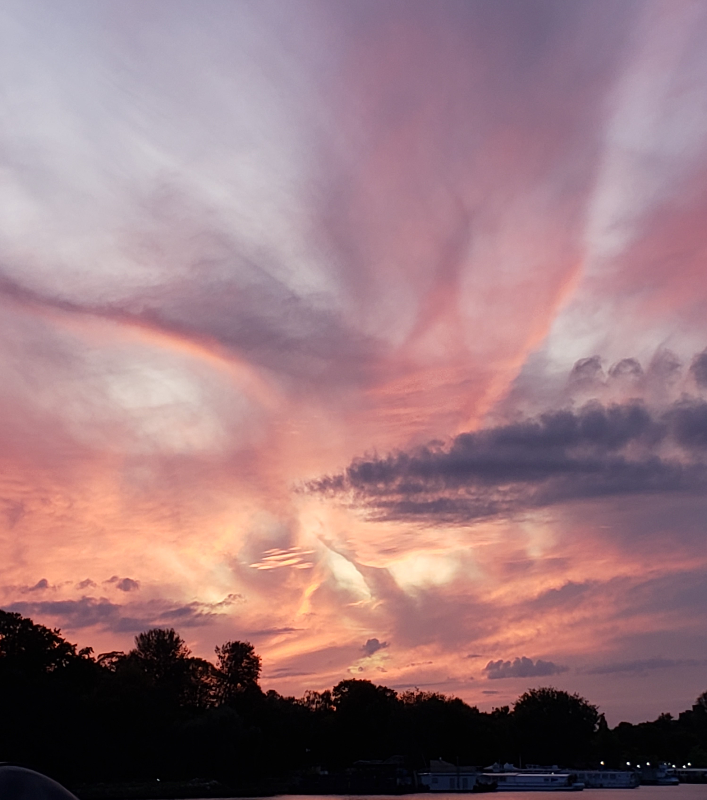

# It's Michael Mandell
### My Learning Journal for Codefellows 102

 | Github is [Michael Mandell](https://github.com/DaddyBearSEA) | 
 

## Table of Contents 

- [Growth Mindset June 1, 2020](growth-mindset.md)
- [Markdown Notes June 2, 2020](markdown-notes.md)
- [Coders Computer June 2, 2020](coders-computer.md)
- [Git vs. Github June 3, 2020](git-github.md)
- [Structure Web pages with HTML June 4, 2020](html-notes.md)
- [CSS Notes June 5 2020 AM Class](css-notes.md)
- [Java Script Notes June 5 2020 PM Class](js-notes.md)
- [Java Script Programming June 8, 2020](js-program.md)

Work in Progress
- [Class HTML Project](https://daddybearsea.github.io/class-project/)

## Other Links

Good videos on Computers and [computer programming](https://www.youtube.com/playlist?list=PLzdnOPI1iJNcsRwJhvksEo1tJqjIqWbN-)

[Slack](https://app.slack.com/client/T039KG69K/D01419MJVAB/thread/C039KG6A1-1591124619.046600)

[Canvas](https://canvas.instructure.com/)

[FrontRow](https://frontrowviews.com/Home/Event/ProviderDetails/5a83c3f209310b1d68d45c46)

***NOTE: All pictures used are from my own camera. Samsung Galaxy S7J or S9. Berlin, Seattle, and Calgary. I'm a foody! so drinks and food are my jam!***

